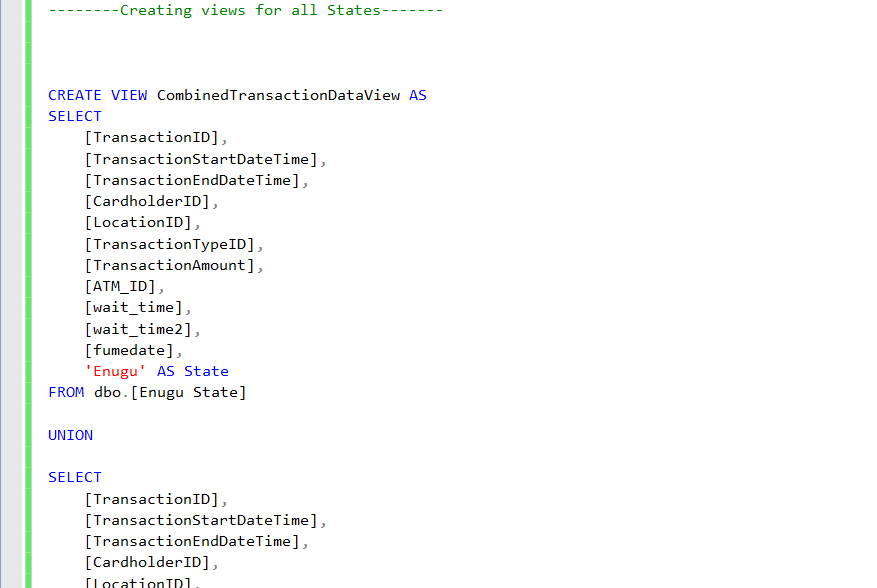
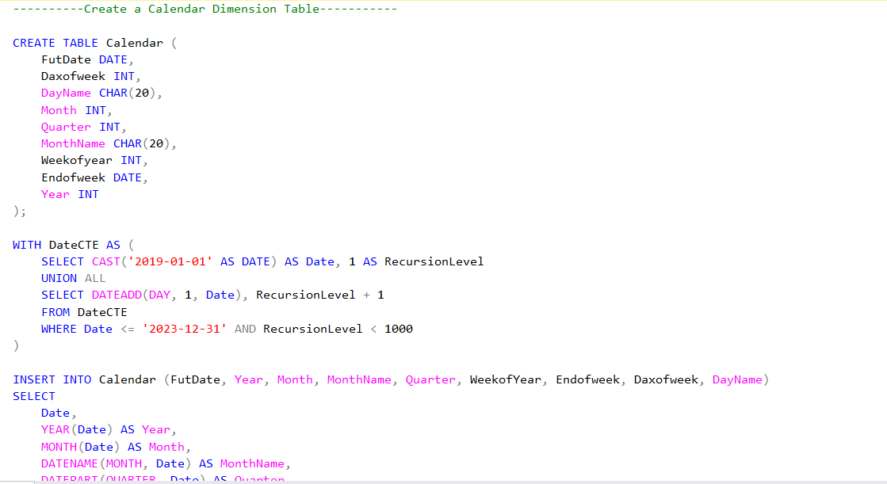
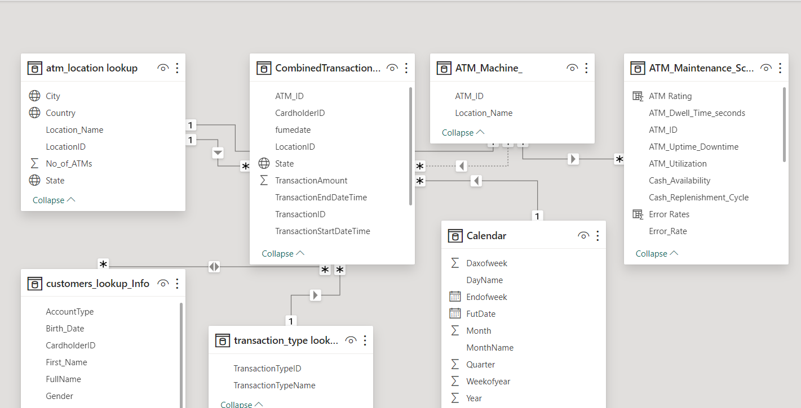
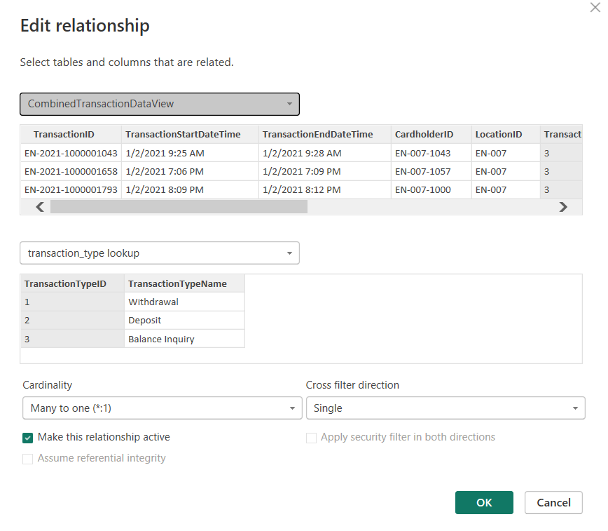
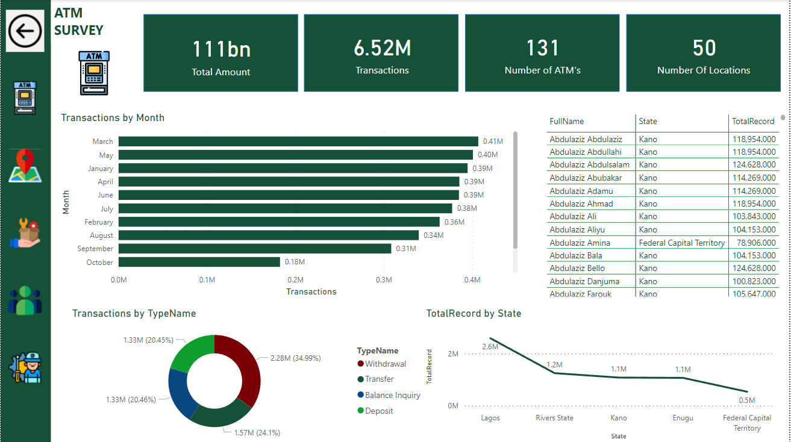
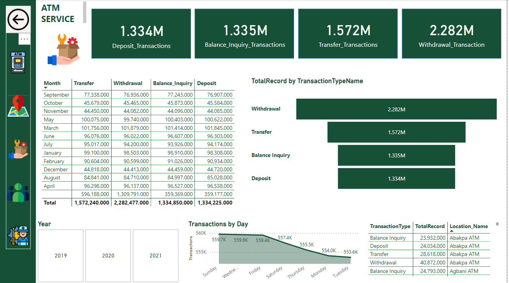

# ATM SERVICE OPTIMIZATION

---

## Introduction

In the dynamic landscape of modern banking, retaining customer loyalty is a pivotal element for the success of financial institutions. Launching a transformative Business Intelligence and Data Analytics project, our goal is to uncover valuable insights that enhance our understanding of customer behavior, boost operational efficiency, and foster enduring customer relationships. Through data analytics, we aim to explore data-driven strategies that optimize ATM performance, ultimately leading to improved customer retention. Retaining customer loyalty is a pivotal element for the success of financial institutions in the dynamic landscape of modern banking. The ability to retain dedicated customers directly influences profitability, market share, and brand reputation. One crucial touchpoint with customers is the Automated Teller Machine (ATM), a fundamental channel for cash withdrawal and various banking transactions.

---

## ATM Objective

Nurturing lasting relationships and ensuring sustained success in the competitive financial landscape is the objective of this project. By optimizing ATM performance, banks can improve operational efficiency and deliver an exceptional customer experience, empowering financial institutions with tools to make informed decisions driving customer retention and loyalty. With the power of data analytics and a customer-centric approach, this project aspires to achieve these objectives.
Determining Factors Influencing Customer Retention
Pinpointing factors that influence customer retention involves analyzing transaction data and gathering customer feedback. By examining transaction success rates, wait times, and overall customer experience, we can identify key factors that impact whether customers choose to continue their relationship with a financial institution. This analysis allows us to understand the aspects that contribute to customer satisfaction and loyalty, enabling us to develop strategies to enhance retention rates.

Evaluate ATM Usage Pattern: Understanding the patterns of ATM usage is crucial for optimizing service availability and ensuring customer satisfaction. By delving into the data, we can identify peak hours, days, and seasonal trends when customers engage with ATMs the most. This analysis allows us to align resources and optimize operations to meet the demand during high-traffic periods. Additionally, it helps us identify any potential bottlenecks or areas for improvement in the ATM service delivery, allowing us to enhance the overall customer experience and maximize customer convenience.

Access ATM Performance :Evaluating the performance of individual ATMs and comparing their performance across different locations is essential for identifying areas of improvement and making informed decisions regarding resource allocation. By analyzing key performance indicators such as transaction success rates, transaction processing times, uptime, and customer feedback, we can identify ATMs that may require maintenance or optimization. This evaluation allows us to prioritize resources and efforts, ensuring that the ATMs with the highest impact on customer satisfaction and operational efficiency receive the necessary attention. Additionally, it enables us to identify best practices and replicate them across locations, ultimately improving overall ATM performance and customer experience.

To Enhance ATM Maintenance and Servicing: It is crucial to evaluate maintenance schedules and correlate them with ATM performance. By analyzing data on maintenance activities and their impact on ATM downtime and disruptions, we can identify opportunities to improve the efficiency and effectiveness of servicing processes. This evaluation allows us to identify patterns or trends that may indicate the need for adjustments in the maintenance schedule or proactive measures to prevent potential issues. By optimizing servicing and maintenance, we can minimize downtime, maximize ATM availability, and ensure a seamless customer experience.

To Enhance ATM Maintenance and Servicing: It is crucial to evaluate maintenance schedules and correlate them with ATM performance. By analyzing data on maintenance activities and their impact on ATM downtime and disruptions, we can identify opportunities to improve the efficiency and effectiveness of servicing processes. This evaluation allows us to identify patterns or trends that may indicate the need for adjustments in the maintenance schedule or proactive measures to prevent potential issues. By optimizing servicing and maintenance, we can minimize downtime, maximize ATM availability, and ensure a seamless customer experience.

---

## Tools Used

1. Microsoft SQL Server: This relational database management system (RDBMS) is utilized for data storage, retrieval, and management. It supports efficient data processing, query optimization, and data integration.
2. Microsoft Power BI Desktop: This powerful business intelligence tool is used for data visualization, analysis, and reporting. It enables the creation of interactive dashboards, charts, and reports to gain insights from the data.
3. Microsoft Fabric: This tool provides efficient data management and analysis capabilities. It offers functionalities for data transformation, data modeling, and data integration, assisting in the processing and analysis of large datasets.

These tools work in conjunction to facilitate data analysis, transformation, modeling, and visualization, enabling the project team to uncover valuable insights from the ATM transaction data and drive informed decision-making.

---

## Dataset Description

The dataset used in this project consists of several dimension tables and one fact table. The dimension tables provide additional information and context about various aspects of the data, while the fact table contains the actual transaction data.
1. Customer Dimension Table: This table contains information about the customers, such as customer ID, name, contact details, and possibly demographic information.
2. ATM Maintenance Dimension Table: This table includes details about ATM maintenance activities, such as maintenance schedules, maintenance personnel, and any relevant maintenance logs or records.
3. Calendar Dimension Table: The calendar table is used to track dates and time-related information. It may include details such as dates, months, years, and day of the week, which can be used for time-based analysis.
4. ATM Location Dimension Table: This table provides information about the locations of the ATMs. It may include details such as the ATM ID, address, city, state, and geographical coordinates.
5. Hour Dimension Table: The hour dimension table contains information about specific hours of the day. It can be used to analyze ATM usage patterns and identify peak hours.
6. Transaction Type Dimension Table: This table defines the different types of transactions that can be performed at the ATMs. It may include transaction codes or names, descriptions, and possibly additional attributes related to each transaction type.
7. CombinedTransactionDataView Table (Fact Table): This fact table contains the actual transaction data, including details such as transaction ID, timestamp, customer ID, ATM ID, transaction type, transaction amount, and other relevant transaction-specific information. The transactions in the dataset are categorized based on the five different states in Nigeria: Lagos, Enugu, FCT (Federal Capital Territory), Rivers, and Kano.
By analyzing this dataset, the project aims to gain insights into ATM usage patterns, customer behavior, and other factors that can influence customer retention and overall ATM performance.

---

## Data Sourcing 

Enhance comprehension of the data. Through its comprehensive explanations, it enables users to grasp the underlying essence, content, and interrelationships of the data elements. Armed with this profound understanding, analysts and data scientists can conduct more effective and insightful data analysis, allowing for deeper interpretation and meaningful insights. By explicitly defining the allowed values, data types, and constraints associated with each column, it serves as a source of reference for maintaining data accuracy and preventing errors during data entry. Consequently, it acts as a safeguard, upholding the integrity of the data and promoting its reliability.

---

## Data Transformation

In the data transformation processes executed on Microsoft SQL Server, several operations were performed to manipulate and modify the data. These operations include:
1. Appending Data: Data from different sources or files may have been combined or appended to create a unified dataset. This process involves merging or concatenating data from multiple tables or files into a single table.
2. Generating New Calendar Tables: New calendar tables may have been created to provide additional time-related information for analysis purposes. These tables can include various attributes such as dates, months, years, day of the week, and other relevant time dimensions.
3. Creating a Bridge Table: A bridge table may have been created to establish a relationship between the transaction table and the maintenance table. This allows for linking transactions with the corresponding maintenance activities based on common key attributes.
4. Modifying Specific Tables: Tables may have been modified using alter and update functions to add or modify columns, change data types, or update specific values based on certain conditions. These modifications ensure that the data is structured appropriately for analysis and meets the project requirements.
Microsoft SQL Server provides a comprehensive set of functions and capabilities for performing these data transformation tasks efficiently. These transformations enable the dataset to be structured in a way that is suitable for analysis, allowing for the extraction of meaningful insights and patterns from the data.

SQL Example1          |   SQL Example2
:---------------------| :----------------------:
      |     

---

## Data Modelling

In the data modeling phase, the snowflake model was implemented to connect all the facts and dimensions seamlessly. The snowflake model is a dimensional modeling technique where dimension tables are further normalized, resulting in a more normalized and structured data model.
The import storage mode was used to bring the data into Power BI. Import mode allows for faster performance as the data is loaded into memory, enabling interactive and responsive data exploration and visualization.
In Power BI, relationships were established between the fact and dimension tables. These relationships define how the tables are related to each other and enable Power BI to perform accurate data analysis and visualizations.
The relationships were likely established using the primary key and foreign key relationships between the tables. One-to-many cardinality relationships were defined, indicating that one record in the dimension table can be related to multiple records in the fact table.
Additionally, a single filter direction was set for the relationships. This means that filtering applied on one table would propagate to related tables in a single direction, ensuring consistent and synchronized filtering behavior across the data model.
By implementing the snowflake model and establishing relationships in Power BI, the data can be effectively analyzed, and interactive visualizations can be created to gain insights and tell a compelling data story.

Snokeflake_Schema               |   Relationship
:---------------------          | :----------------------:
      |     

---

## Analysis and Visualization

The detailed four-year analysis of the ATM transactions between 2019 and 2022 provides valuable insights into various aspects of the data. Here are the key findings:
1. Transactions: There were a total of 6.52 million ATM transactions recorded during the four-year period, indicating a substantial level of ATM usage.
2. Transaction Types: Withdrawals were the most dominant transaction type, accounting for 34.99% of all transactions. Transfers, balance inquiries, and deposits followed, with percentages of 24.1%, 20.46%, and 20.45%, respectively.
3. Student Population: The student population led in terms of transaction volume, with 818,669 transactions recorded. On average, these transactions had a relatively short waiting time of 5.69 minutes
4. Geographical Distribution: Lagos had the highest share of transactions at 43.21%, indicating a high level of ATM usage in that region. Rivers, Kano, Enugu, and Abuja followed, with percentages of 20.88%, 18.96%, 17.86%, and 8.25%, respectively.
These insights provide a comprehensive understanding of the ATM usage patterns, transaction types, customer demographics, geographical distribution, waiting times, and maintenance performance. This information can be used to identify areas for improvement, optimize service availability, enhance customer satisfaction, and allocate resources effectively. Visualizations, such as charts and dashboards, can further enhance the understanding and communication of these findings.

Snokeflake_Schema               |   Relationship
:---------------------          | :----------------------:
             |     

---

## Conclusion

In conclusion, the analysis of ATM servicing and maintenance highlights the importance of treating ATMs as more than just machines. They are crucial financial gateways that require careful attention and maintenance to ensure their reliability and efficiency. The findings emphasize the need to prioritize the maintenance of the least maintained ATMs and to provide special care to ATMs located near student environments, considering their high transaction volume.
By embracing data-driven optimization, banks and financial institutions can enhance the overall customer experience and maximize the value of ATMs as convenient and reliable self-service channels. Utilizing insights from data analysis, banks can allocate resources effectively, optimize maintenance schedules, and improve the performance and availability of ATMs.
In this data-driven era, leveraging tools like Microsoft SQL Server, Microsoft Power BI Desktop, and Microsoft Fabric enables efficient data management, analysis, and visualization, empowering organizations to make informed decisions and drive continuous improvements in ATM servicing and maintenance.
By taking proactive measures to optimize servicing and maintenance processes, banks can minimize downtime, prevent disruptions, and provide customers with a seamless and reliable ATM experience. This, in turn, strengthens customer satisfaction, builds trust, and reinforces the role of ATMs as vital components of the modern banking landscape. _**Click here to interact with the full project [Here](https://app.powerbi.com/view?r=eyJrIjoiNTVlZDcyODctNTM0Ny00MTkzLWFmOWQtYTU1NTA4Mzc3NjU4IiwidCI6ImFiZGNmZDJiLTM1MWUtNGViYi05MTk3LTJmN2UyMDRkMzJjNyJ9)**_

---

## Recommendation

Based on the insights gained from the analysis and the vision for the future, here are some recommendations for banks and financial institutions to enhance the ATM experience and unlock its hidden potential:
1. Embrace Digital Transformation: Invest in digital technologies to transform the ATM experience. Explore the integration of cutting-edge technologies like biometrics (such as fingerprint or facial recognition) to provide secure and convenient authentication methods for customers. Implement contactless payment options, such as NFC (Near Field Communication) or mobile wallet integration, to enable seamless transactions.
2. Enhance Security Measures: Strengthen the security of ATMs to protect customer data and prevent fraudulent activities. Implement advanced security features such as encryption, tamper-proof hardware, and real-time monitoring systems to detect and respond to potential threats proactively.
3. Improve Connectivity: Ensure seamless connectivity of ATMs to the wider network of financial services. Enable real-time transaction processing and data synchronization to provide up-to-date information to customers and facilitate immediate account updates.
4. Personalize the ATM Experience: Leverage customer data and analytics to personalize the ATM experience. Offer tailored recommendations, targeted promotions, and customized user interfaces based on individual customer preferences and transaction history. This can enhance customer engagement and satisfaction.
5. Enable Self-Service Transactions: Expand the range of self-service transactions available at ATMs. In addition to traditional services like withdrawals and balance inquiries, provide options for bill payments, fund transfers, loan applications, and other financial services. This empowers customers with greater control and convenience.
6. Implement Predictive Maintenance: Utilize predictive maintenance techniques to proactively identify and address potential issues with ATMs. By leveraging data analytics and machine learning algorithms, banks can predict maintenance needs, optimize servicing schedules, and minimize downtime.
7. Foster Collaboration: Collaborate with fintech companies, payment processors, and other industry partners to leverage their expertise and innovative solutions. This can facilitate the integration of new payment methods, enhance security measures, and drive continuous improvement in the ATM ecosystem.
By implementing these recommendations, banks and financial institutions can unlock the hidden potential of ATMs and create a future-ready ATM ecosystem that offers a faster, more secure, and seamlessly connected experience for customers. This will not only strengthen customer loyalty but also position ATMs as an integral part of the broader digital financial services landscape.
8. Empowering Customer
Absolutely, empowering customers should indeed be a central focus of any ATM strategy. Here are some additional recommendations to further empower customers and strengthen their relationship with financial institutions through the ATM experience:
9. Optimizing Security
In today's digital landscape, ensuring maximum security is of utmost importance for banks and financial institutions. To safeguard customers' transactions and personal information, it is imperative to invest in robust security measures. Here are some recommendations to maximize security

---

## Additional Resources

1. Project Data set **[Here](https://www.novypro.com/project/atm-service-optimization)**

2. Dax Analysis Expression Function (DAX) and SQL SCRIPT **[Here](script)**
